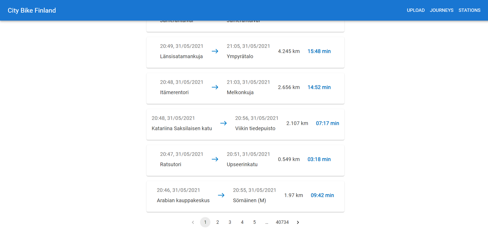
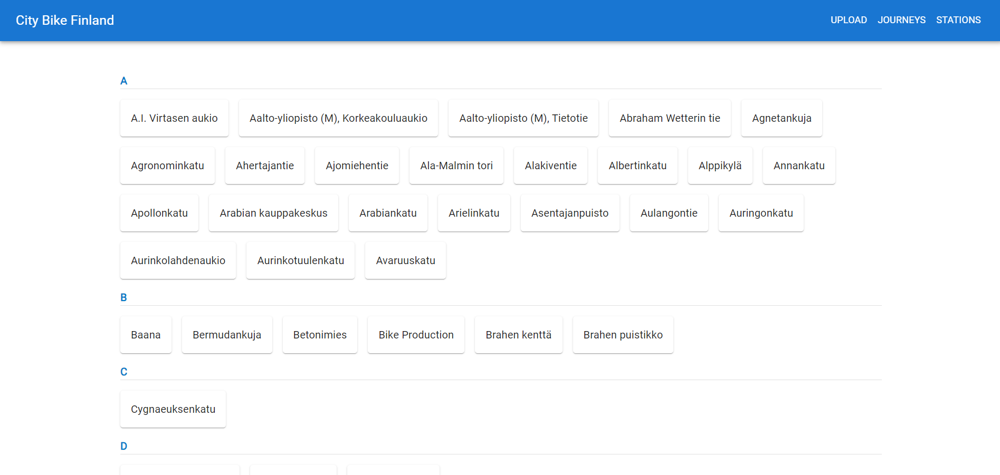
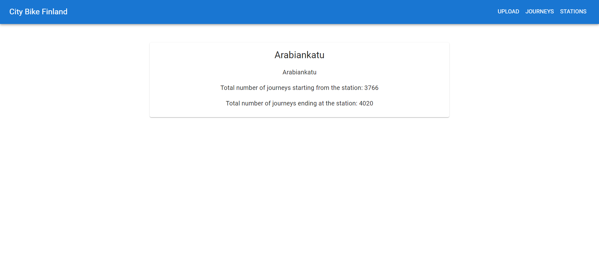
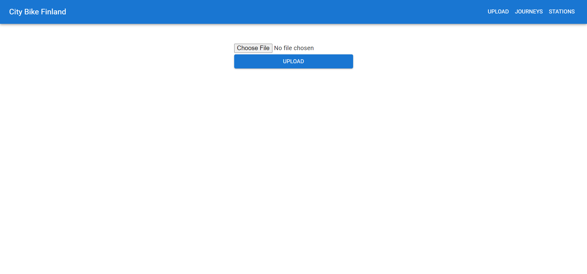

[![Contributors][contributors-shield]][contributors-url]
[![Forks][forks-shield]][forks-url]
[![Stargazers][stars-shield]][stars-url]
[![Issues][issues-shield]][issues-url]
[![MIT License][license-shield]][license-url]
[![LinkedIn][linkedin-shield]][linkedin-url]

<br />
<div align="center">
  <h3 align="center">Bikes App</h3>

  <p align="center">
    <br />
    <a href="https://github.com/AlikiKap/bikes_app.git"><strong>Explore the docs »</strong></a>
    <br />
    <br />
    <a href="https://alikikap.github.io/bikes_app/">View Demo</a>
    ·
    <a href="https://github.com/AlikiKap/bikes_app/issues">Report Bug</a>
    ·
    <a href="https://github.com/AlikiKap/bikes_app/issues">Request Feature</a>
  </p>
</div>


## Table of contents
1. [About The Project](#about-the-project)
    * [Task](#task)
    * [Built With](#built-with)
2. [Installation](#installation)
    * [Backend](#backend)
    * [Frontend](#frontend)
3. [Usage](#usage)
4. [License](#license)
5. [Contact](#contact)
### Journeys View

### Stations View

### Single Station View

### Upload View

## About The Project

This Project was a test task from Solita.
* Import data from the CSV files to a database or in-memory storage
* Validate data before importing
* Don't import journeys that lasted for less than ten seconds
* Don't import journeys that covered distances shorter than 10 meters
#### Journeys View
* List journeys
* For each journey show departure and return stations, covered distance in kilometers and duration in minutes
#### Stations View
* List all the stations
#### Single Station View
* Station name
*  Station address
*  Total number of journeys starting from the station
*  Total number of journeys ending at the station
### Task
  https://github.com/solita/dev-academy-2023-exercise
### Built With
* [![React][React.js]][React-url]
* 
* 

<p align="right">(<a href="#readme-top">back to top</a>)</p>

## Installation
### Backend
will be added soon
### Frontend
Follow these steps to get the project up and running on your local machine:

Clone the repository:

```bash
  git clone https://github.com/AlikiKap/bikes_app.git
```
Navigate to the project directory:
```bash
  cd bikes_app
  cd city_bike_finland
```
Install the dependencies:
```bash
  npm install
```
## Usage

Once you have installed the dependencies, you can start the development server:

```bash
  npm run start
```
This will start the application in development mode, and you can access it in your web browser at http://localhost:3000.
<br/>

## License

Distributed under the MIT License. See `LICENSE.txt` for more information.

<p align="right">(<a href="#readme-top">back to top</a>)</p>

## Contact

Aliki Kapasakalidi - [@AlikiKap](https://www.linkedin.com/in/aliki-kapasakalidi-921891203/) - aliki02.kapasakalidi@gmail.com

Project Link: [https://github.com/AlikiKap/wolt-delivery-calculator.git](https://github.com/AlikiKap/wolt-delivery-calculator.git)

<p align="right">(<a href="#readme-top">back to top</a>)</p>


[contributors-shield]: https://img.shields.io/github/contributors/AlikiKap/bikes_app.svg?style=for-the-badge
[contributors-url]: https://github.com/AlikiKap/bikes_app/graphs/contributors
[forks-shield]: https://img.shields.io/github/forks/AlikiKap/bikes_app.svg?style=for-the-badge
[forks-url]: https://github.com/AlikiKap/bikes_app/network/members
[stars-shield]: https://img.shields.io/github/stars/AlikiKap/bikes_app.svg?style=for-the-badge
[stars-url]: https://github.com/AlikiKap/bikes_app/stargazers
[issues-shield]: https://img.shields.io/github/issues/AlikiKap/bikes_app.svg?style=for-the-badge
[issues-url]: https://github.com/AlikiKap/bikes_app/issues
[license-shield]: https://img.shields.io/github/license/AlikiKap/bikes_app.svg?style=for-the-badge
[license-url]: https://github.com/AlikiKap/bikes_app/blob/main/LICENSE
[linkedin-shield]: https://img.shields.io/badge/-LinkedIn-black.svg?style=for-the-badge&logo=linkedin&colorB=555
[linkedin-url]: https://www.linkedin.com/in/aliki-kapasakalidi-921891203/
[React.js]: https://img.shields.io/badge/React-20232A?style=for-the-badge&logo=react&logoColor=61DAFB
[React-url]: https://reactjs.org/